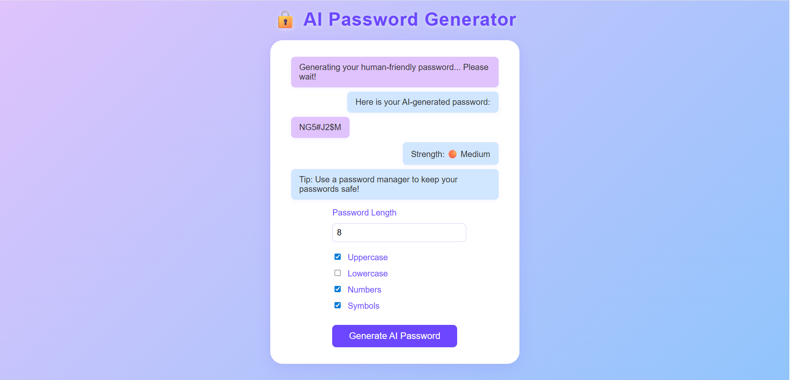

# 🔒 AI Password Generator

## 🖼️ Preview


A modern, AI-powered password generator built with Flask and OpenRouter API that creates secure, human-friendly strong passwords with an intuitive chat-like interface.

## ✨ Features

- **AI-Powered Generation**: Uses OpenRouter API to generate intelligent, secure passwords
- **Interactive Chat Interface**: Modern AI assistant-style user experience
- **Customizable Options**: 
  - Password length (8-32 characters)
  - Character types (uppercase, lowercase, numbers, symbols)
- **Real-time Strength Analysis**: Visual password strength indicator
- **Responsive Design**: Works seamlessly on desktop and mobile devices
- **Loading Animations**: Engaging AI thinking animations during generation

## 🚀 Quick Start

### Prerequisites

- Python 3.7+
- OPENROUTER API KEY

### Installation

1. **Clone the repository**
   ```bash
   git clone <repository-url>
   cd ai-password-generator
   ```

2. **Install dependencies**
   ```bash
   pip install -r requirements.txt
   ```

3. **Set up environment variables**
   Create a `.env` file in the project root:
   ```env
OPENROUTER_API_KEY=your_openai_api_key_here
   ```

4. **Run the application**
   ```bash
   python app.py
   ```

5. **Open your browser**
   Navigate to `http://localhost:5000`

## 📁 Project Structure

```
ai-password-generator/
├── app.py                 # Flask backend application
├── requirements.txt       # Python dependencies
├── .env                   # Environment variables (create this)
├── templates/
│   └── index.html        # Main HTML template
├── static/
│   ├── app.js            # Frontend JavaScript
│   └── style.css         # CSS styles
└── README.md             # This file
```

## 🛠️ Dependencies

```
flask
openai
requests
python-dotenv
cors
flask-cors
flask-restful
```

## 🎯 How It Works

1. **User Input**: Select password preferences through the intuitive form
2. **AI Processing**: Flask backend sends request to OpenAI API with specific prompts
3. **Smart Generation**: AI creates passwords that are both secure and memorable
4. **Strength Analysis**: Client-side analysis provides immediate feedback
5. **Chat Interface**: Results displayed in a conversational AI assistant format

## 🔧 Configuration

### Password Options

- **Length**: 8-32 characters (default: 16)
- **Character Types**:
  - ✅ Uppercase letters (A-Z)
  - ✅ Lowercase letters (a-z)
  - ✅ Numbers (0-9)
  - ✅ Symbols (!@#$%^&*)

### Strength Indicators

- 🟢 **Very Strong**: 5/5 criteria met
- 🟡 **Strong**: 4/5 criteria met
- 🟠 **Medium**: 3/5 criteria met
- 🔴 **Weak**: <3 criteria met

## 🌐 API Endpoints

### `POST /api/ai-password`

Generates an AI-powered password based on provided criteria.

**Request Body:**
```json
{
  "length": 16,
  "uppercase": true,
  "lowercase": true,
  "numbers": true,
  "symbols": true
}
```

**Response:**
```json
{
  "password": "SecurePass123!",
  "raw_output": {...}
}
```

## 🎨 UI Features

- **Modern Design**: Clean, professional interface with AI-themed styling
- **Responsive Layout**: Optimized for all device sizes
- **Loading States**: Animated dots during AI processing
- **Chat Bubbles**: Conversational UI elements
- **Real-time Updates**: Instant feedback and results

## 🔒 Security Best Practices

- Environment variables for API keys
- CORS protection enabled
- Client-side validation
- Secure password generation algorithms
- No password storage or logging

## 🚀 Deployment

### Local Development
```bash
python app.py
```

## 🤝 Contributing

1. Fork the repository
2. Create a feature branch (`git checkout -b feature/amazing-feature`)
3. Commit your changes (`git commit -m 'Add amazing feature'`)
4. Push to the branch (`git push origin feature/amazing-feature`)
5. Open a Pull Request

## 📝 License

This project is licensed under the MIT License - see the [LICENSE](LICENSE) file for details.

**Khandaker Atik** – 2025 CSE Graduate, BRAC University   
🔗 [Portfolio Website](https://atikur-rahman.vercel.app)  
📧 khandakeratik43@gmail.com

## 🙏 Acknowledgments

- OpenRouter for providing the AI API
- Flask community for the excellent web framework
- Modern web design inspiration from AI chat interfaces

## 📞 Support

If you encounter any issues or have questions:

- Create a new issue with detailed information
- Include error messages and steps to reproduce

---
